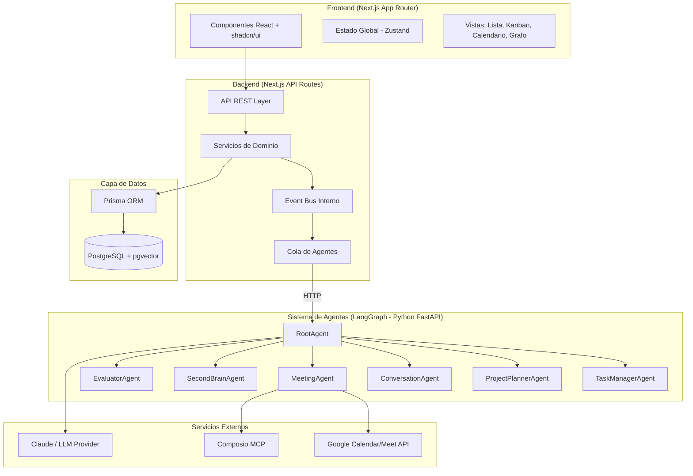
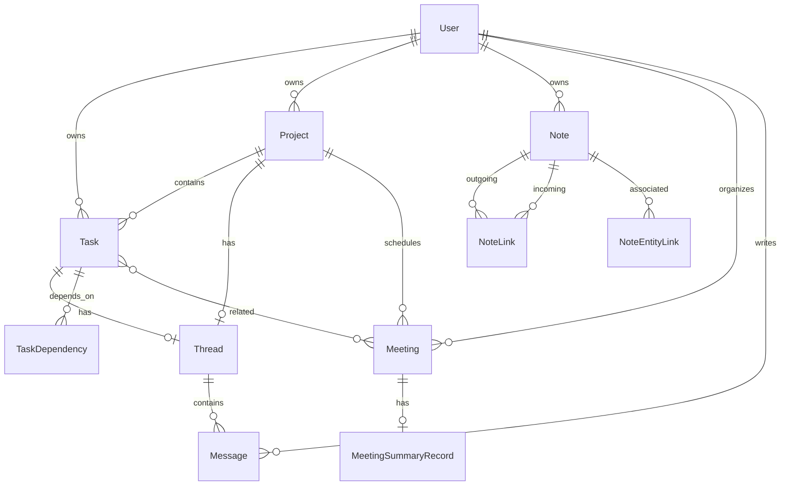
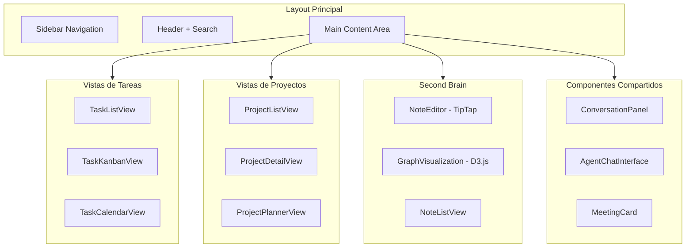
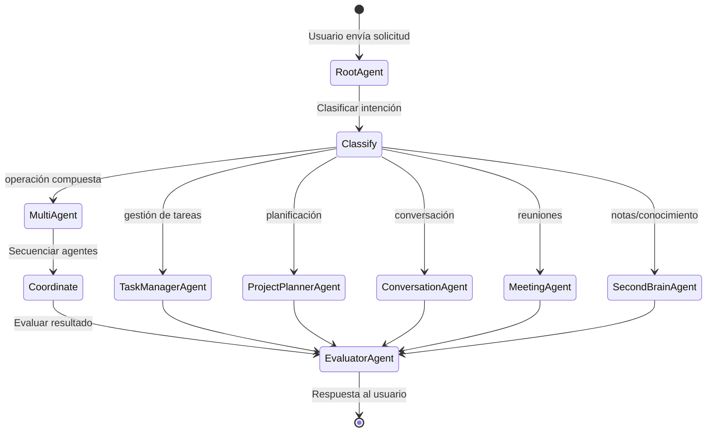

# Documento de Diseño — AI Project Platform

## Visión General

AI Project Platform es una aplicación web full-stack que integra gestión de tareas/proyectos, hilos de conversación, integración con Google Meet, un sistema de notas tipo "second brain" con grafo de conocimiento, y una arquitectura multi-agente de IA para orquestar todas las funcionalidades.

La plataforma sigue una arquitectura de tres capas:
- **Frontend**: Next.js (App Router) con React, TypeScript, Tailwind CSS y shadcn/ui
- **Backend**: Next.js API Routes + servicios desacoplados con Prisma ORM
- **Agentes IA**: Orquestación multi-agente con LangGraph (servicio Python FastAPI desacoplado). Next.js API Routes llama al servicio vía HTTP para operaciones de IA
- **Persistencia**: PostgreSQL con pgvector para búsqueda semántica

### Principios de Diseño

1. **Modularidad**: Cada dominio (tareas, conversaciones, reuniones, second brain) es un módulo independiente
2. **Agentes como servicios**: Los agentes IA exponen interfaces bien definidas y son orquestados por el RootAgent
3. **Event-driven**: Las operaciones entre módulos se coordinan mediante eventos internos
4. **Búsqueda semántica nativa**: Todos los contenidos textuales se indexan como embeddings en pgvector
5. **Seguridad por diseño**: OAuth2 + JWT, validación de entradas, protección contra prompt injection

---

## Arquitectura

### Diagrama de Alto Nivel



### Flujo de Datos Principal

1. El usuario interactúa con el frontend (Next.js App Router)
2. Las solicitudes llegan a las API Routes del backend
3. Los servicios de dominio procesan la lógica de negocio
4. Para operaciones que requieren IA, se publica un evento al Event Bus
5. La cola de agentes envía la solicitud vía HTTP al servicio Python (FastAPI + LangGraph)
6. El RootAgent enruta al subagente apropiado, el EvaluatorAgent valida la calidad
7. El resultado se retorna al backend Node.js y se persiste vía Prisma en PostgreSQL

### Estructura de Directorios

```
ai-project-platform/
├── src/
│   ├── app/                          # Next.js App Router
│   │   ├── (auth)/                   # Rutas de autenticación
│   │   ├── (dashboard)/              # Layout principal
│   │   │   ├── tasks/                # Vistas de tareas
│   │   │   ├── projects/             # Vistas de proyectos
│   │   │   ├── meetings/             # Reuniones
│   │   │   ├── brain/                # Second Brain
│   │   │   └── search/               # Búsqueda semántica
│   │   └── api/                      # API Routes
│   │       ├── tasks/
│   │       ├── projects/
│   │       ├── conversations/
│   │       ├── meetings/
│   │       ├── notes/
│   │       ├── search/
│   │       └── agents/
│   ├── components/                   # Componentes React
│   │   ├── ui/                       # shadcn/ui base
│   │   ├── tasks/
│   │   ├── projects/
│   │   ├── conversations/
│   │   ├── meetings/
│   │   ├── brain/
│   │   └── shared/
│   ├── lib/                          # Lógica compartida
│   │   ├── services/                 # Servicios de dominio
│   │   ├── agents/                   # Cliente HTTP para servicio de agentes Python
│   │   ├── db/                       # Prisma client y queries
│   │   ├── events/                   # Event bus
│   │   ├── embeddings/               # Generación de embeddings
│   │   └── auth/                     # Autenticación
│   ├── hooks/                        # React hooks custom
│   └── types/                        # TypeScript types
├── prisma/
│   └── schema.prisma                 # Schema de base de datos
├── agents/                           # Servicio Python (FastAPI + LangGraph)
│   ├── main.py                       # FastAPI app entry point
│   ├── agents/                       # Implementación de agentes
│   │   ├── root_agent.py
│   │   ├── task_manager_agent.py
│   │   ├── project_planner_agent.py
│   │   ├── conversation_agent.py
│   │   ├── meeting_agent.py
│   │   ├── second_brain_agent.py
│   │   └── evaluator_agent.py
│   ├── schemas/                      # Pydantic schemas
│   ├── requirements.txt
│   └── Dockerfile
├── public/
└── tests/
    ├── unit/
    └── property/
```

---

## Componentes e Interfaces

### Módulo de Tareas (Sistema_Tareas)

```typescript
// src/lib/services/task.service.ts
interface TaskService {
  create(data: CreateTaskInput): Promise<Task>;
  update(id: string, data: UpdateTaskInput): Promise<Task>;
  delete(id: string): Promise<void>;
  getById(id: string): Promise<Task | null>;
  listByProject(projectId: string, filters?: TaskFilters): Promise<Task[]>;
  listByUser(userId: string, filters?: TaskFilters): Promise<Task[]>;
  addDependency(taskId: string, dependsOnId: string): Promise<void>;
  removeDependency(taskId: string, dependsOnId: string): Promise<void>;
  validateNoCycles(taskId: string, dependsOnId: string): Promise<boolean>;
  updateStatus(taskId: string, status: TaskStatus): Promise<Task>;
}

interface CreateTaskInput {
  name: string;
  description?: string;
  projectId?: string;
  priority?: Priority;       // default: "medium"
  status?: TaskStatus;       // default: "pending"
  dueDate?: Date;
  assigneeId?: string;
}

type TaskStatus = "pending" | "in_progress" | "completed" | "blocked" | "review";
type Priority = "low" | "medium" | "high";
```

### Módulo de Proyectos

```typescript
// src/lib/services/project.service.ts
interface ProjectService {
  create(data: CreateProjectInput): Promise<Project>;
  update(id: string, data: UpdateProjectInput): Promise<Project>;
  delete(id: string, options: { deleteTasks: boolean }): Promise<void>;
  getById(id: string): Promise<ProjectWithTasks | null>;
  listByUser(userId: string): Promise<Project[]>;
  addTask(projectId: string, taskId: string): Promise<void>;
  removeTask(projectId: string, taskId: string): Promise<void>;
  getProgress(projectId: string): Promise<ProjectProgress>;
}
```

### Módulo de Conversaciones (Sistema_Conversación)

```typescript
// src/lib/services/conversation.service.ts
interface ConversationService {
  createThread(entityType: "task" | "project", entityId: string): Promise<Thread>;
  getThread(threadId: string): Promise<ThreadWithMessages>;
  postMessage(threadId: string, data: PostMessageInput): Promise<Message>;
  getMessages(threadId: string, pagination: Pagination): Promise<Message[]>;
  parseMentions(content: string): Mention[];
}

interface PostMessageInput {
  content: string;
  authorId: string;
  authorType: "user" | "agent";
}

interface Mention {
  type: "task" | "project" | "note" | "user";
  id: string;
  displayText: string;
}
```

### Módulo de Reuniones (Sistema_Reuniones)

```typescript
// src/lib/services/meeting.service.ts
interface MeetingService {
  create(data: CreateMeetingInput): Promise<Meeting>;
  getById(id: string): Promise<Meeting | null>;
  listByUser(userId: string): Promise<Meeting[]>;
  listUpcoming(userId: string): Promise<Meeting[]>;
  createGoogleEvent(meeting: Meeting): Promise<GoogleEventResult>;
  storeSummary(meetingId: string, summary: MeetingSummary): Promise<void>;
}

interface CreateMeetingInput {
  title: string;
  description?: string;
  scheduledAt: Date;
  duration: number; // minutes
  taskId?: string;
  projectId?: string;
  attendees: string[];
}

interface MeetingSummary {
  overview: string;
  decisions: string[];
  actionItems: ActionItem[];
}

interface ActionItem {
  description: string;
  assigneeId?: string;
  dueDate?: Date;
}
```

### Módulo Second Brain (Sistema_SecondBrain)

```typescript
// src/lib/services/note.service.ts
interface NoteService {
  create(data: CreateNoteInput): Promise<Note>;
  update(id: string, data: UpdateNoteInput): Promise<Note>;
  delete(id: string): Promise<void>;
  getById(id: string): Promise<NoteWithBacklinks | null>;
  listByUser(userId: string, filters?: NoteFilters): Promise<Note[]>;
  parseWikilinks(content: string): WikilinkReference[];
  updateLinks(noteId: string, links: WikilinkReference[]): Promise<void>;
  getBacklinks(noteId: string): Promise<Backlink[]>;
  getGraph(userId: string): Promise<KnowledgeGraph>;
  associateWith(noteId: string, entity: EntityReference): Promise<void>;
}

interface WikilinkReference {
  target: string;         // texto dentro de [[...]]
  targetNoteId?: string;  // ID si la nota existe
  exists: boolean;
}

interface KnowledgeGraph {
  nodes: GraphNode[];
  edges: GraphEdge[];
}

interface GraphNode {
  id: string;
  label: string;
  type: "note" | "task" | "project" | "meeting";
}

interface GraphEdge {
  source: string;
  target: string;
  type: "wikilink" | "association";
}
```

### Parser de Markdown con Wikilinks

```typescript
// src/lib/services/markdown-parser.ts
interface MarkdownParser {
  parse(markdown: string): NoteAST;
  format(ast: NoteAST): string;
  extractWikilinks(content: string): string[];
}

interface NoteAST {
  content: string;           // contenido markdown limpio
  wikilinks: WikilinkNode[];
  metadata: NoteMetadata;
}

interface WikilinkNode {
  raw: string;         // [[concepto]]
  target: string;      // concepto
  position: { start: number; end: number };
}
```

### Sistema de Agentes

```typescript
// src/lib/agents/types.ts
interface AgentRequest {
  id: string;
  userId: string;
  input: string;
  context: AgentContext;
  targetAgent?: AgentType;
}

interface AgentResponse {
  id: string;
  requestId: string;
  agent: AgentType;
  content: string;
  actions: AgentAction[];
  metadata: {
    tokensUsed: number;
    latencyMs: number;
    cost: number;
  };
}

type AgentType = 
  | "root" 
  | "task_manager" 
  | "project_planner" 
  | "conversation" 
  | "meeting" 
  | "second_brain" 
  | "evaluator";

interface AgentAction {
  type: string;
  payload: Record<string, unknown>;
  result?: unknown;
}

// src/lib/agents/root-agent.ts
interface RootAgent {
  route(request: AgentRequest): Promise<AgentResponse>;
  coordinate(request: AgentRequest, agents: AgentType[]): Promise<AgentResponse>;
}

// src/lib/agents/evaluator-agent.ts
interface EvaluatorAgent {
  evaluate(response: AgentResponse, criteria: EvaluationCriteria): Promise<EvaluationResult>;
}

interface EvaluationResult {
  score: number;          // 0-1
  passed: boolean;
  feedback?: string;
}
```

### Event Bus Interno

```typescript
// src/lib/events/event-bus.ts
interface EventBus {
  publish(event: DomainEvent): Promise<void>;
  subscribe(eventType: string, handler: EventHandler): void;
}

type DomainEvent = 
  | { type: "task.created"; payload: Task }
  | { type: "task.updated"; payload: { task: Task; changes: Partial<Task> } }
  | { type: "task.deleted"; payload: { id: string } }
  | { type: "project.created"; payload: Project }
  | { type: "meeting.completed"; payload: Meeting }
  | { type: "note.created"; payload: Note }
  | { type: "note.updated"; payload: Note }
  | { type: "agent.request"; payload: AgentRequest }
  | { type: "agent.response"; payload: AgentResponse };
```

### Módulo de Embeddings y Búsqueda Semántica

```typescript
// src/lib/embeddings/embedding.service.ts

interface EmbeddingConfig {
  model: "text-embedding-3-small" | "text-embedding-3-large";
  dimensions: 1536 | 3072;       // 1536 para text-embedding-3-small (recomendado)
  maxTokens: number;              // truncar texto largo antes de generar embedding
}

// Estrategia de generación por tipo de contenido:
// - Tasks: name + description (max 500 tokens)
// - Notes: content truncado chunk-by-chunk (max 4000 tokens por chunk)
// - Meeting summaries: overview + decisions + actionItems concatenados
// - Messages: no indexar individualmente, solo thread summaries

interface EmbeddingService {
  generate(text: string): Promise<number[]>;
  generateBatch(texts: string[]): Promise<number[][]>;
  index(entityType: string, entityId: string, embedding: number[]): Promise<void>;
  search(query: string, options?: SearchOptions): Promise<SearchResult[]>;
}

interface SearchOptions {
  limit?: number;          // default: 10
  entityTypes?: string[];  // filtrar por tipo
  threshold?: number;      // similitud mínima (0-1)
}

interface SearchResult {
  entityType: string;
  entityId: string;
  score: number;
  snippet: string;
}
```

---

## Modelos de Datos

### Schema de Base de Datos (Prisma)

```prisma
// prisma/schema.prisma
generator client {
  provider        = "prisma-client-js"
  previewFeatures = ["postgresqlExtensions"]
}

datasource db {
  provider   = "postgresql"
  url        = env("DATABASE_URL")
  extensions = [vector]
}

model User {
  id            String    @id @default(cuid())
  email         String    @unique
  name          String
  avatarUrl     String?
  createdAt     DateTime  @default(now())
  updatedAt     DateTime  @updatedAt

  tasks         Task[]
  projects      Project[]
  notes         Note[]
  messages      Message[]
  meetings      Meeting[] @relation("MeetingOrganizer")
  agentLogs     AgentLog[]

  @@map("users")
}

model Task {
  id            String      @id @default(cuid())
  name          String
  description   String?
  status        TaskStatus  @default(PENDING)
  priority      Priority    @default(MEDIUM)
  dueDate       DateTime?
  createdAt     DateTime    @default(now())
  updatedAt     DateTime    @updatedAt

  userId        String
  user          User        @relation(fields: [userId], references: [id])

  projectId     String?
  project       Project?    @relation(fields: [projectId], references: [id])

  thread        Thread?
  meeting       Meeting?    @relation(fields: [meetingId], references: [id])
  meetingId     String?

  // Dependencias
  dependsOn     TaskDependency[] @relation("DependentTask")
  dependedBy    TaskDependency[] @relation("DependencyTarget")

  // Notas asociadas
  noteLinks     NoteEntityLink[]

  // Embedding para búsqueda semántica
  embedding     Unsupported("vector(1536)")?

  @@index([userId, status])
  @@index([projectId])
  @@map("tasks")
}

enum TaskStatus {
  PENDING
  IN_PROGRESS
  COMPLETED
  BLOCKED
  REVIEW
}

enum Priority {
  LOW
  MEDIUM
  HIGH
}

model TaskDependency {
  id            String  @id @default(cuid())
  taskId        String
  dependsOnId   String

  task          Task    @relation("DependentTask", fields: [taskId], references: [id], onDelete: Cascade)
  dependsOn     Task    @relation("DependencyTarget", fields: [dependsOnId], references: [id], onDelete: Cascade)

  @@unique([taskId, dependsOnId])
  @@map("task_dependencies")
}

model Project {
  id            String    @id @default(cuid())
  name          String
  description   String?
  createdAt     DateTime  @default(now())
  updatedAt     DateTime  @updatedAt

  userId        String
  user          User      @relation(fields: [userId], references: [id])

  tasks         Task[]
  thread        Thread?
  meetings      Meeting[]
  noteLinks     NoteEntityLink[]

  @@index([userId])
  @@map("projects")
}

model Thread {
  id            String    @id @default(cuid())
  entityType    String    // "task" | "project"
  entityId      String
  createdAt     DateTime  @default(now())

  taskId        String?   @unique
  task          Task?     @relation(fields: [taskId], references: [id], onDelete: Cascade)

  projectId     String?   @unique
  project       Project?  @relation(fields: [projectId], references: [id], onDelete: Cascade)

  messages      Message[]

  @@map("threads")
}

model Message {
  id            String    @id @default(cuid())
  content       String
  authorType    String    // "user" | "agent"
  createdAt     DateTime  @default(now())

  threadId      String
  thread        Thread    @relation(fields: [threadId], references: [id], onDelete: Cascade)

  authorId      String?
  author        User?     @relation(fields: [authorId], references: [id])

  agentType     String?   // tipo de agente si authorType == "agent"

  @@index([threadId, createdAt])
  @@map("messages")
}

model Meeting {
  id            String    @id @default(cuid())
  title         String
  description   String?
  scheduledAt   DateTime
  duration      Int       // minutos
  meetUrl       String?
  googleEventId String?
  status        MeetingStatus @default(SCHEDULED)
  createdAt     DateTime  @default(now())
  updatedAt     DateTime  @updatedAt

  organizerId   String
  organizer     User      @relation("MeetingOrganizer", fields: [organizerId], references: [id])

  projectId     String?
  project       Project?  @relation(fields: [projectId], references: [id])

  tasks         Task[]
  summary       MeetingSummaryRecord?
  noteLinks     NoteEntityLink[]

  @@index([organizerId, scheduledAt])
  @@map("meetings")
}

enum MeetingStatus {
  SCHEDULED
  IN_PROGRESS
  COMPLETED
  CANCELLED
}

model MeetingSummaryRecord {
  id            String    @id @default(cuid())
  overview      String
  decisions     Json      // string[]
  actionItems   Json      // ActionItem[]
  createdAt     DateTime  @default(now())

  meetingId     String    @unique
  meeting       Meeting   @relation(fields: [meetingId], references: [id], onDelete: Cascade)

  embedding     Unsupported("vector(1536)")?

  @@map("meeting_summaries")
}
```

```prisma
model Note {
  id            String    @id @default(cuid())
  title         String
  content       String    // Markdown content
  createdAt     DateTime  @default(now())
  updatedAt     DateTime  @updatedAt

  userId        String
  user          User      @relation(fields: [userId], references: [id])

  // Wikilinks salientes
  outgoingLinks NoteLink[] @relation("SourceNote")
  // Backlinks (notas que enlazan a esta)
  incomingLinks NoteLink[] @relation("TargetNote")

  // Asociaciones con otras entidades
  entityLinks   NoteEntityLink[]

  // Embedding para búsqueda semántica
  embedding     Unsupported("vector(1536)")?

  @@index([userId])
  @@map("notes")
}

model NoteLink {
  id            String    @id @default(cuid())
  sourceNoteId  String
  targetNoteId  String?   // null si la nota referenciada no existe aún
  targetTitle   String    // texto del wikilink, sirve como referencia pendiente
  createdAt     DateTime  @default(now())

  sourceNote    Note      @relation("SourceNote", fields: [sourceNoteId], references: [id], onDelete: Cascade)
  targetNote    Note?     @relation("TargetNote", fields: [targetNoteId], references: [id], onDelete: SetNull)

  @@unique([sourceNoteId, targetTitle])
  @@map("note_links")
}

model NoteEntityLink {
  id            String    @id @default(cuid())
  noteId        String
  entityType    String    // "task" | "project" | "meeting"
  entityId      String
  createdAt     DateTime  @default(now())

  note          Note      @relation(fields: [noteId], references: [id], onDelete: Cascade)
  task          Task?     @relation(fields: [entityId], references: [id], map: "note_entity_task_fk")
  project       Project?  @relation(fields: [entityId], references: [id], map: "note_entity_project_fk")
  meeting       Meeting?  @relation(fields: [entityId], references: [id], map: "note_entity_meeting_fk")

  @@unique([noteId, entityType, entityId])
  @@map("note_entity_links")
}

model AgentLog {
  id            String    @id @default(cuid())
  requestId     String
  agent         String    // AgentType
  action        String
  input         Json
  output        Json?
  status        String    // "success" | "error" | "timeout"
  tokensUsed    Int?
  latencyMs     Int?
  costEstimate  Float?
  createdAt     DateTime  @default(now())

  userId        String
  user          User      @relation(fields: [userId], references: [id])

  @@index([userId, createdAt])
  @@index([agent, createdAt])
  @@map("agent_logs")
}
```

### Índices Vectoriales (pgvector)

```sql
-- Migración manual para índices vectoriales
CREATE INDEX idx_tasks_embedding ON tasks 
  USING ivfflat (embedding vector_cosine_ops) WITH (lists = 100);

CREATE INDEX idx_notes_embedding ON notes 
  USING ivfflat (embedding vector_cosine_ops) WITH (lists = 100);

CREATE INDEX idx_meeting_summaries_embedding ON meeting_summaries 
  USING ivfflat (embedding vector_cosine_ops) WITH (lists = 100);
```

### Diagrama Entidad-Relación



---

## API REST — Endpoints

### Tareas

| Método | Ruta | Descripción |
|--------|------|-------------|
| POST | `/api/tasks` | Crear tarea |
| GET | `/api/tasks` | Listar tareas del usuario (con filtros) |
| GET | `/api/tasks/:id` | Obtener tarea por ID |
| PATCH | `/api/tasks/:id` | Actualizar tarea |
| DELETE | `/api/tasks/:id` | Eliminar tarea |
| POST | `/api/tasks/:id/dependencies` | Agregar dependencia |
| DELETE | `/api/tasks/:id/dependencies/:depId` | Remover dependencia |
| PATCH | `/api/tasks/:id/status` | Cambiar estado |

### Proyectos

| Método | Ruta | Descripción |
|--------|------|-------------|
| POST | `/api/projects` | Crear proyecto |
| GET | `/api/projects` | Listar proyectos del usuario |
| GET | `/api/projects/:id` | Obtener proyecto con tareas |
| PATCH | `/api/projects/:id` | Actualizar proyecto |
| DELETE | `/api/projects/:id` | Eliminar proyecto |
| POST | `/api/projects/:id/tasks` | Asociar tarea a proyecto |

### Conversaciones

| Método | Ruta | Descripción |
|--------|------|-------------|
| GET | `/api/threads/:id` | Obtener hilo con mensajes |
| POST | `/api/threads/:id/messages` | Publicar mensaje |
| GET | `/api/threads/:id/messages` | Listar mensajes (paginado) |

### Reuniones

| Método | Ruta | Descripción |
|--------|------|-------------|
| POST | `/api/meetings` | Crear reunión |
| GET | `/api/meetings` | Listar reuniones del usuario |
| GET | `/api/meetings/:id` | Obtener reunión con resumen |
| POST | `/api/meetings/:id/process` | Procesar post-reunión |
| GET | `/api/meetings/upcoming` | Próximas reuniones |

### Notas (Second Brain)

| Método | Ruta | Descripción |
|--------|------|-------------|
| POST | `/api/notes` | Crear nota |
| GET | `/api/notes` | Listar notas del usuario |
| GET | `/api/notes/:id` | Obtener nota con backlinks |
| PATCH | `/api/notes/:id` | Actualizar nota |
| DELETE | `/api/notes/:id` | Eliminar nota |
| GET | `/api/notes/graph` | Obtener grafo de conocimiento |
| POST | `/api/notes/:id/associate` | Asociar nota a entidad |

### Búsqueda

| Método | Ruta | Descripción |
|--------|------|-------------|
| POST | `/api/search` | Búsqueda semántica |

### Agentes

| Método | Ruta | Descripción |
|--------|------|-------------|
| POST | `/api/agents/chat` | Enviar solicitud al sistema de agentes |
| GET | `/api/agents/chat/:id/stream` | SSE stream de respuesta de agente |
| GET | `/api/agents/logs` | Obtener logs de agentes |

### Autenticación

| Método | Ruta | Descripción |
|--------|------|-------------|
| POST | `/api/auth/login` | Iniciar sesión OAuth2 |
| POST | `/api/auth/refresh` | Refrescar token |
| POST | `/api/auth/logout` | Cerrar sesión |
| GET | `/api/auth/me` | Obtener usuario actual |

---

## Arquitectura Frontend

### Componentes Principales



### Estado Global (Zustand)

```typescript
// src/hooks/stores.ts
interface AppStore {
  // UI State
  sidebarOpen: boolean;
  activeView: "list" | "kanban" | "calendar" | "graph";
  
  // Data
  tasks: Task[];
  projects: Project[];
  notes: Note[];
  
  // Actions
  setActiveView: (view: string) => void;
  // ... CRUD actions delegadas a servicios
}
```

### Componente KanbanBoard

```typescript
// src/components/tasks/KanbanBoard.tsx
// Usa @dnd-kit para drag & drop
// Columnas: pending, in_progress, review, blocked, completed
// Al soltar una tarea en otra columna, llama a PATCH /api/tasks/:id/status
```

### Editor TipTap para Notas

```typescript
// src/components/brain/NoteEditor.tsx
// Extensiones: StarterKit, Markdown, WikilinkExtension (custom)
// WikilinkExtension: detecta [[...]] y renderiza como enlace interactivo
// Al guardar: extrae wikilinks, llama a PATCH /api/notes/:id
```

### Visualización del Grafo (D3.js)

```typescript
// src/components/brain/KnowledgeGraph.tsx
// Force-directed graph con D3.js
// Nodos: notas (color principal), tareas/proyectos (colores secundarios)
// Aristas: wikilinks (línea sólida), asociaciones (línea punteada)
// Interacciones: zoom, pan, click para preview, doble-click para navegar
```

---

## Diseño del Sistema de Agentes

### Arquitectura LangGraph



### Flujo del RootAgent

1. Recibe solicitud del usuario
2. Clasifica la intención usando el LLM (tool-use con funciones de enrutamiento)
3. Determina si es operación simple (un agente) o compuesta (múltiples agentes)
4. Despacha al(los) agente(s) correspondiente(s)
5. El EvaluatorAgent valida la calidad de la respuesta
6. Si la calidad es insuficiente, reintenta una vez
7. Retorna respuesta al usuario

### Cola de Prioridades para Agentes

```typescript
// src/lib/agents/queue.ts
interface AgentQueue {
  enqueue(request: AgentRequest, priority: QueuePriority): Promise<string>;
  process(): Promise<void>;
  getStatus(requestId: string): Promise<QueueStatus>;
}

type QueuePriority = "high" | "normal" | "low";
// high: operaciones del usuario en tiempo real
// normal: procesamiento post-reunión, generación de planes
// low: indexación de embeddings, sugerencias de conexiones
```

### Integración con Google Meet/Calendar

```typescript
// src/lib/integrations/google-calendar.ts
// Usa Composio MCP Server o google-meet-mcp-server para autenticación OAuth2 con Google

interface GoogleCalendarService {
  createEventWithMeet(data: CreateEventInput): Promise<GoogleEvent>;
  listEvents(userId: string, options: ListOptions): Promise<GoogleEvent[]>;
  getEvent(eventId: string): Promise<GoogleEvent>;
  updateEvent(eventId: string, data: UpdateEventInput): Promise<GoogleEvent>;
}

interface GoogleMeetService {
  getMeetingDetails(meetId: string): Promise<MeetDetails>;
  getTranscript(meetId: string): Promise<Transcript | null>;
}

interface CreateEventInput {
  title: string;
  description?: string;
  startTime: Date;
  endTime: Date;
  attendees: string[];
  createMeetLink: boolean;
}

interface GoogleEvent {
  id: string;
  meetLink?: string;
  htmlLink: string;
  status: string;
}

// MeetingAgent workflow:
// 1. createEventWithMeet → crea Google Event con Meet link
// 2. store GoogleEventId en Meeting (Prisma)
// 3. Post-reunión: getTranscript (si disponible) → generar summary con LLM
// 4. Extraer action items → TaskManagerAgent crea tareas
```

---

## Propiedades de Correctitud

*Una propiedad es una característica o comportamiento que debe mantenerse verdadero en todas las ejecuciones válidas de un sistema — esencialmente, una declaración formal sobre lo que el sistema debe hacer. Las propiedades sirven como puente entre especificaciones legibles por humanos y garantías de correctitud verificables por máquinas.*

### Propiedad 1: Valores por defecto en creación de tareas

*Para cualquier* nombre y descripción válidos proporcionados al crear una tarea, la tarea resultante debe tener estado "pending" y prioridad "medium" cuando no se especifican explícitamente.

**Valida: Requisitos 1.1**

### Propiedad 2: Actualización parcial preserva campos no modificados

*Para cualquier* tarea existente y cualquier conjunto parcial de campos a actualizar, después de la actualización solo los campos especificados deben cambiar, el campo `updatedAt` debe ser posterior al valor anterior, y todos los demás campos deben permanecer iguales.

**Valida: Requisitos 1.2**

### Propiedad 3: Eliminación de tarea limpia dependencias

*Para cualquier* tarea con dependencias (entrantes o salientes), al eliminarla, la tarea no debe existir en el sistema y ninguna dependencia debe referenciarla.

**Valida: Requisitos 1.3**

### Propiedad 4: Validación de campos enum

*Para cualquier* cadena de texto proporcionada como estado de tarea, debe ser aceptada si y solo si es uno de ["pending", "in_progress", "completed", "blocked", "review"]. Para cualquier cadena proporcionada como prioridad, debe ser aceptada si y solo si es una de ["low", "medium", "high"].

**Valida: Requisitos 1.4, 1.5**

### Propiedad 5: Detección de ciclos en dependencias

*Para cualquier* grafo acíclico dirigido de dependencias entre tareas, agregar una arista que formaría un ciclo debe ser rechazado por el sistema. Agregar una arista que no forma ciclo debe ser aceptado.

**Valida: Requisitos 1.6**

### Propiedad 6: Proyecto contiene todas sus tareas asociadas

*Para cualquier* proyecto con N tareas asociadas, al consultar el proyecto se deben obtener exactamente esas N tareas con sus estados y prioridades actuales.

**Valida: Requisitos 2.2, 2.3**

### Propiedad 7: Eliminación de proyecto respeta modo seleccionado

*Para cualquier* proyecto con tareas asociadas, al eliminarlo con `deleteTasks=true` las tareas deben ser eliminadas, y con `deleteTasks=false` las tareas deben persistir sin asociación a proyecto.

**Valida: Requisitos 2.4**

### Propiedad 8: Ordenamiento de tareas en vista lista

*Para cualquier* lista de tareas y criterio de ordenamiento (prioridad, estado, fecha), el resultado debe estar correctamente ordenado según el criterio seleccionado.

**Valida: Requisitos 3.1**

### Propiedad 9: Drag & drop actualiza estado

*Para cualquier* tarea y cualquier columna destino válida en la vista Kanban, mover la tarea a esa columna debe resultar en que el estado de la tarea sea igual al estado representado por la columna destino.

**Valida: Requisitos 3.4**

### Propiedad 10: Creación de entidad genera hilo de conversación

*Para cualquier* tarea o proyecto creado, debe existir exactamente un hilo de conversación asociado a esa entidad.

**Valida: Requisitos 4.1, 5.1**

### Propiedad 11: Mensajes se almacenan en orden cronológico

*Para cualquier* secuencia de mensajes publicados en un hilo, al recuperar los mensajes deben estar en orden cronológico ascendente y cada mensaje debe contener autor, fecha y contenido idénticos a los publicados.

**Valida: Requisitos 4.2, 4.5**

### Propiedad 12: Parsing de menciones en mensajes

*Para cualquier* mensaje que contenga sintaxis de mención (de tarea, proyecto, nota o usuario), el parser debe extraer correctamente el tipo y el identificador de cada recurso mencionado.

**Valida: Requisitos 4.3**

### Propiedad 13: Reuniones asociadas a entidades

*Para cualquier* reunión creada con referencia a una tarea o proyecto, la asociación debe ser almacenada y recuperable al consultar la reunión.

**Valida: Requisitos 6.2**

### Propiedad 14: Listado de reuniones futuras ordenado cronológicamente

*Para cualquier* conjunto de reuniones de un usuario, al consultar las próximas reuniones solo deben retornarse las que tienen `scheduledAt` posterior al momento actual, ordenadas de más próxima a más lejana.

**Valida: Requisitos 6.3**

### Propiedad 15: Round-trip de parsing de Markdown con Wikilinks

*Para cualquier* NoteAST válido, formatear a Markdown y luego parsear debe producir un NoteAST equivalente al original.

**Valida: Requisitos 8.6, 8.7, 8.8**

### Propiedad 16: Wikilinks generan enlaces bidireccionales

*Para cualquier* nota con wikilinks, al guardarla el sistema debe crear registros de enlace consultables desde ambas direcciones (outgoing desde la nota fuente, backlinks desde la nota destino). Al editar y remover un wikilink, el enlace debe desaparecer de ambas direcciones.

**Valida: Requisitos 8.2, 8.3, 8.4, 9.4**

### Propiedad 17: Wikilinks a notas inexistentes crean enlaces pendientes

*Para cualquier* nota con un wikilink `[[X]]` donde no existe una nota con título "X", el sistema debe crear un enlace con `targetNoteId=null` y `targetTitle="X"`.

**Valida: Requisitos 8.5**

### Propiedad 18: Grafo de conocimiento refleja estructura de enlaces

*Para cualquier* conjunto de notas con wikilinks de un usuario, el grafo de conocimiento debe tener exactamente un nodo por nota y una arista por cada wikilink existente.

**Valida: Requisitos 9.1**

### Propiedad 19: Asociaciones bidireccionales nota-entidad

*Para cualquier* nota asociada a una entidad (tarea, proyecto o reunión), la asociación debe ser recuperable tanto al consultar la nota como al consultar la entidad.

**Valida: Requisitos 10.1, 10.2, 10.3**

### Propiedad 20: Enrutamiento del RootAgent

*Para cualquier* solicitud de usuario con una intención clasificable, el RootAgent debe enrutar la solicitud al subagente correcto según la clasificación de intención.

**Valida: Requisitos 13.1**

### Propiedad 21: Observabilidad de operaciones de agentes

*Para cualquier* operación ejecutada por un agente, debe existir un registro de log con: agente involucrado, acción, resultado, timestamp, tokens usados, latencia y costo estimado.

**Valida: Requisitos 13.3, 17.1, 17.2**

### Propiedad 22: Retry y fallo graceful de agentes

*Para cualquier* solicitud de agente que falla, el sistema debe reintentar exactamente una vez. Si falla nuevamente, debe retornar un error descriptivo al usuario sin crash.

**Valida: Requisitos 13.4**

### Propiedad 23: Búsqueda semántica retorna resultados por relevancia

*Para cualquier* consulta de búsqueda y conjunto de documentos indexados, los resultados deben estar ordenados por score de similitud descendente.

**Valida: Requisitos 14.1**

### Propiedad 24: Creación/actualización genera embedding

*Para cualquier* nota, tarea o resumen de reunión creado o actualizado, debe existir un embedding vectorial asociado en la base de datos.

**Valida: Requisitos 14.2**

### Propiedad 25: Aislamiento de acceso entre usuarios

*Para cualquier* usuario y cualquier recurso (tarea, proyecto, nota, reunión) perteneciente a otro usuario, intentar acceder debe resultar en error de autorización.

**Valida: Requisitos 15.2**

### Propiedad 26: Sanitización de entradas contra XSS

*Para cualquier* entrada de usuario que contenga payloads XSS (scripts, event handlers, iframes), la salida renderizada no debe contener código ejecutable no sanitizado.

**Valida: Requisitos 15.3**

### Propiedad 27: Sanitización contra prompt injection

*Para cualquier* entrada de usuario que contenga patrones de inyección de prompts (instrucciones de sistema, role-play attacks), el texto enviado al LLM debe estar sanitizado o encapsulado para prevenir la inyección.

**Valida: Requisitos 15.4**

### Propiedad 28: Alertas por latencia excesiva de agentes

*Para cualquier* operación de agente cuya latencia supere los 10 segundos, debe registrarse una alerta en el sistema de monitoreo.

**Valida: Requisitos 17.4**

### Propiedad 29: Cola de prioridades procesa en orden correcto

*Para cualquier* conjunto de solicitudes concurrentes a agentes con diferentes prioridades, las solicitudes de mayor prioridad deben ser procesadas antes que las de menor prioridad.

**Valida: Requisitos 18.4**

### Propiedad 30: Notificaciones por menciones de usuario

*Para cualquier* mensaje en un hilo de proyecto que contenga una mención a un usuario, el usuario mencionado debe recibir una notificación.

**Valida: Requisitos 5.3**

---

## Manejo de Errores

### Estrategia General

| Capa | Estrategia | Implementación |
|------|-----------|----------------|
| API Routes | Middleware de error centralizado | `src/app/api/_middleware.ts` con mapeo de errores a HTTP status |
| Servicios | Excepciones tipadas de dominio | Clases de error: `ValidationError`, `NotFoundError`, `AuthorizationError`, `ConflictError` |
| Agentes | Retry + fallback | RootAgent reintenta 1 vez, luego notifica error al usuario |
| Integraciones externas | Circuit breaker pattern | Para Google Calendar API: retry con backoff exponencial |
| Frontend | Error boundaries + toast notifications | React Error Boundaries por sección, notificaciones con sonner/toast |

### Errores de Dominio

```typescript
// src/lib/errors.ts
abstract class DomainError extends Error {
  abstract readonly statusCode: number;
  abstract readonly code: string;
}

class ValidationError extends DomainError {
  readonly statusCode = 400;
  readonly code = "VALIDATION_ERROR";
}

class NotFoundError extends DomainError {
  readonly statusCode = 404;
  readonly code = "NOT_FOUND";
}

class AuthorizationError extends DomainError {
  readonly statusCode = 403;
  readonly code = "FORBIDDEN";
}

class ConflictError extends DomainError {
  readonly statusCode = 409;
  readonly code = "CONFLICT";
  // Usado para ciclos de dependencia, duplicados, etc.
}

class AgentError extends DomainError {
  readonly statusCode = 502;
  readonly code = "AGENT_ERROR";
  constructor(message: string, public readonly agent: AgentType) {
    super(message);
  }
}

class ExternalServiceError extends DomainError {
  readonly statusCode = 503;
  readonly code = "EXTERNAL_SERVICE_ERROR";
}
```

### Manejo de Errores en Agentes

1. Si el agente falla → RootAgent reintenta una vez
2. Si falla de nuevo → retorna `AgentError` con mensaje descriptivo
3. Se registra en `AgentLog` con status="error"
4. El frontend muestra el error en el chat con opción de reintentar manualmente

### Manejo de Errores en Google Calendar

1. Si la API retorna error → retry con backoff exponencial (3 intentos max)
2. Si todos los intentos fallan → registrar en log, notificar al usuario
3. La reunión se crea localmente con `googleEventId=null` y `meetUrl=null`
4. Se ofrece opción de reintentar la sincronización

---

## Estrategia de Testing

### Enfoque Dual: Unit Tests + Property-Based Tests

La plataforma utiliza un enfoque dual de testing:

- **Unit tests**: Para ejemplos específicos, edge cases, integraciones y flujos de error
- **Property-based tests**: Para validar propiedades universales sobre todas las entradas posibles

Ambos son complementarios y necesarios para cobertura completa.

### Herramientas

| Tipo | Herramienta |
|------|-------------|
| Unit tests | Vitest |
| Property-based tests | fast-check |
| Integration tests | Vitest + Prisma test utils |
| E2E tests | Playwright |
| API tests | Supertest |

### Configuración de Property-Based Tests

- **Mínimo 100 iteraciones** por property test (configurable vía `fc.assert(..., { numRuns: 100 })`)
- Cada test debe referenciar la propiedad del documento de diseño
- Formato de tag: **Feature: ai-project-platform, Property {N}: {título}**

```typescript
// Ejemplo de estructura de property test
import { test } from "vitest";
import fc from "fast-check";

// Feature: ai-project-platform, Property 5: Detección de ciclos en dependencias
test("agregar dependencia cíclica debe ser rechazada", () => {
  fc.assert(
    fc.property(
      generateDAG(),       // genera un DAG aleatorio de tareas
      fc.nat(),            // índice de tarea fuente
      fc.nat(),            // índice de tarea destino
      (dag, sourceIdx, targetIdx) => {
        const source = dag.nodes[sourceIdx % dag.nodes.length];
        const target = dag.nodes[targetIdx % dag.nodes.length];
        const wouldCycle = dag.hasPath(target, source);
        const result = taskService.addDependency(source.id, target.id);
        
        if (wouldCycle) {
          expect(result).toBeRejected();
        } else {
          expect(result).toBeAccepted();
        }
      }
    ),
    { numRuns: 100 }
  );
});
```

### Distribución de Tests

| Módulo | Unit Tests | Property Tests |
|--------|-----------|----------------|
| TaskService | CRUD específicos, edge cases | Props 1-5, 8-9 |
| ProjectService | CRUD, asociaciones | Props 6-7 |
| ConversationService | Mensajes, menciones | Props 10-12, 30 |
| MeetingService | Creación, listado | Props 13-14 |
| NoteService / Parser | CRUD, wikilinks | Props 15-19 |
| AgentSystem | Routing, retry | Props 20-22, 28-29 |
| EmbeddingService | Indexación, búsqueda | Props 23-24 |
| AuthMiddleware | Acceso, sanitización | Props 25-27 |

### Unit Tests — Enfoque

Los unit tests se centran en:
- **Ejemplos concretos**: Crear tarea con datos específicos, verificar valores
- **Edge cases**: Nombres vacíos, descripciones muy largas, Unicode
- **Errores de integración**: Google Calendar falla, LLM timeout
- **Flujos multi-paso**: Post-reunión → resumen → notas → tareas

### Property Tests — Cada Propiedad = Un Test

Cada propiedad de correctitud del diseño se implementa como **un único test property-based** con fast-check. No se divide una propiedad en múltiples tests.

### Cobertura Mínima Esperada

- Servicios de dominio: >90% line coverage
- Parser de Markdown/Wikilinks: >95% (critical path)
- API Routes: >80%
- Componentes React: >70% (con testing-library)
- Sistema de agentes: >75% (mocking LLM responses)
